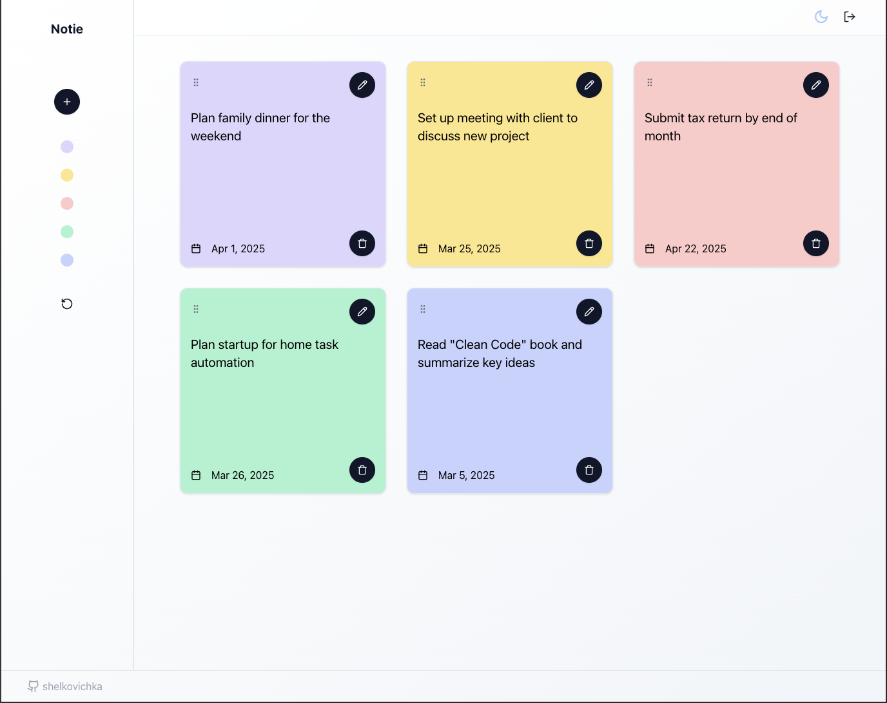

# Redux Toolkit Todo List

A modern task management application built with React and Redux Toolkit.



## 🛠 Technologies

- **React** - JavaScript library for building user interfaces
- **Redux Toolkit** - The official toolset for efficient Redux development
- **React Calendar** - Calendar component for date selection
- **Tailwind CSS** - A utility-first CSS framework for styling

## ✨ Features

- ✅ Create, delete and mark tasks as complete
- 📅 Set due dates for each task
- 🌓 Light and dark theme support
- 📱 Responsive design
- 🗂 Convenient state management with Redux Toolkit

## 🚀 Installation and Setup

1. Clone the repository:

```bash
git clone https://github.com/yourusername/redux-toolkit-to-do-list.git
```

2. Navigate to the project directory:

```bash
cd redux-toolkit-to-do-list
```

3. Install dependencies:

```bash
npm install
```

4. Start the development server:

```bash
npm start
```

## 🔧 Available Scripts

- `npm start` - Runs the app in development mode at http://localhost:3000
- `npm test` - Launches the test runner in interactive watch mode
- `npm run build` - Builds the app for production in the `build` folder
- `npm run eject` - Removes the single build dependency from your project

## 🤝 Contributing

Contributions are welcome! Please follow these steps:

1. Fork the repository
2. Create your feature branch: `git checkout -b feature/new-feature`
3. Commit your changes: `git commit -m 'Add new feature'`
4. Push to the branch: `git push origin feature/new-feature`
5. Submit a pull request

## 📚 Learn More

- [React Documentation](https://reactjs.org/)
- [Redux Toolkit Guide](https://redux-toolkit.js.org/)
- [Tailwind CSS Documentation](https://tailwindcss.com/docs)
